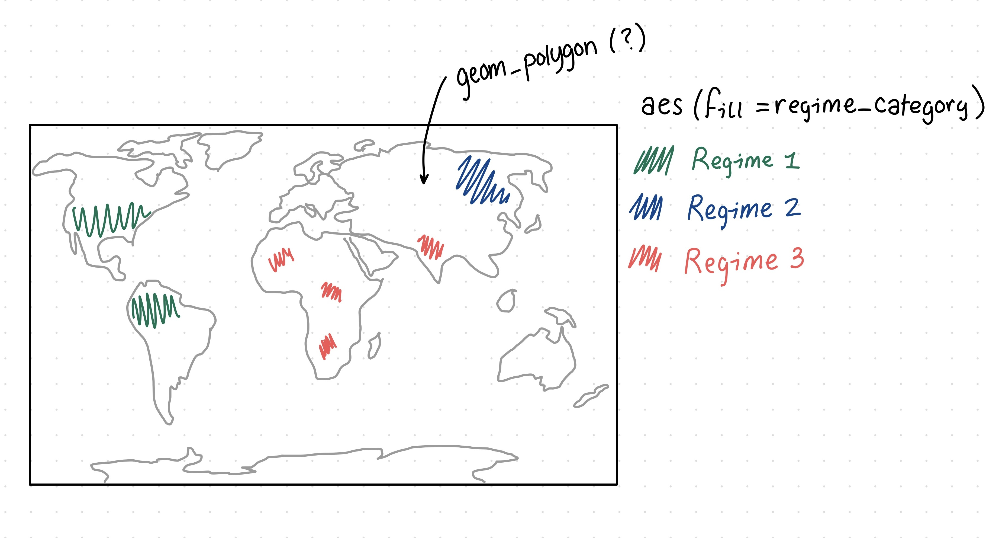
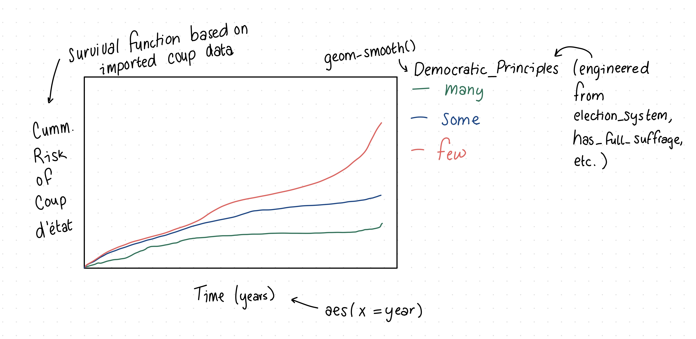

# Checkpoint 1

---
title: "Checkpoint 1"
format: html
  embed-resources: true
editor: visual
---

## Context

The Democracy and Dictatorship (DD) data were part of a TidyTuesday release on November 5th, 2024. TidyTuesday is a community-driven initiative that posts free, weekly datasets online for statisticians and data scientists to practice their data analysis skills. This release updates the data provided in "Regime types and regime change: A new dataset on democracy, coups, and political institutions" by Christian Bjørnskov and Martin Rode ([2020](https://link.springer.com/article/10.1007/s11558-019-09345-1)), with content borrowed from Cheibub et al. (2010) and Alvarex et al. (1996). Bjørnskov and Rode's paper was published in *The Review of International Organizations*, contributing to knowledge in academia and political science. The dataset, which focuses mainly on the presence or absence of democracy (or democratic principals), was then curated and posted on [GitHub](https://github.com/rfordatascience/tidytuesday/blob/main/data/2024/2024-11-05/readme.md) by Jon Harmon.

In their paper, Bjørnskov and Rode aimed to fill a gap in existing data on political regimes by adding additional countries, institutional details, and, importantly, an indicator of successful and failed coup d'états. They did this by selecting definitional criteria for coups and coding each observation accordingly. Specifically, "coups and coup attempts therefore have to \[fulfill\] the following definition to count as such in \[the\] dataset: First, the objective must be to overthrow the executive branch. Second, actors have to be previously linked to the state apparatus in some way. Third, a coup or coup attempt cannot last longer than a week at most." These data, among other things, can help us learn about the value of democracy by revealing the frequency and conditions under which a country adopts a non-democratic system and how long that intervention lasts. As stated, the DD data are more minimalistic, focusing on the presence or absence of democracy, and supplementing these data with Bjørnskov and Rode's coup data may prove insightful.

## Cleaning

```{r}
#| label: cleaning
#| warning: false

# Data from the package {democracyData}
# install.packages("pak")
# pak::pak("xmarquez/democracyData")
library(democracyData)
library(tidyverse)

democracy_data <-
  democracyData::pacl_update |> 
  janitor::clean_names() |> 
  dplyr::select(
    "country_name" = "pacl_update_country",
    "country_code" = "pacl_update_country_isocode",
    "year",
    "regime_category_index" = "dd_regime",
    "regime_category" = "dd_category",
    "is_monarchy" = "monarchy",
    "is_commonwealth" = "commonwealth",
    "monarch_name",
    "monarch_accession_year" = "monarch_accession",
    "monarch_birthyear",
    "is_female_monarch" = "female_monarch",
    "is_democracy" = "democracy",
    "is_presidential" = "presidential",
    "president_name",
    "president_accesion_year" = "president_accesion",
    "president_birthyear",
    "is_interim_phase" = "interim_phase",
    "is_female_president" = "female_president",
    "is_colony" = "colony",
    "colony_of",
    "colony_administrated_by",
    "is_communist" = "communist",
    "has_regime_change_lag" = "regime_change_lag",
    "spatial_democracy",
    "parliament_chambers" = "no_of_chambers_in_parliament",
    "has_proportional_voting" = "proportional_voting",
    "election_system",
    "lower_house_members" = "no_of_members_in_lower_house",
    "upper_house_members" = "no_of_members_in_upper_house",
    "third_house_members" = "no_of_members_in_third_house",
    "has_new_constitution" = "new_constitution",
    "has_full_suffrage" = "fullsuffrage",
    "suffrage_restriction",
    "electoral_category_index" = "electoral",
    "spatial_electoral",
    "has_alternation" = "alternation",
    "is_multiparty" = "multiparty",
    "has_free_and_fair_election" = "free_and_fair_election",
    "parliamentary_election_year",
    "election_month" = "election_month_year",
    "has_postponed_election" = "postponed_election"
  ) |>
  dplyr::mutate(
    election_month = dplyr::na_if(.data$election_month, "?")
  ) |> 
  tidyr::separate_wider_regex(
    "election_month",
    patterns = c(
      election_month = "\\D+",
      election_year = "\\d{4}$"
    ),
    too_few = "align_start"
  ) |> 
  dplyr::mutate(
    electoral_category = dplyr::case_match(
      .data$electoral_category_index,
      0 ~ "no elections",
      1 ~ "single-party elections",
      2 ~ "non-democratic multi-party elections",
      3 ~ "democratic elections"
    ),
    .after = "electoral_category_index"
  ) |> 
  dplyr::mutate(
    election_month = stringr::str_squish(.data$election_month),
    dplyr::across(
      c(
        tidyselect::ends_with("_index"),
        tidyselect::contains("year"),
        tidyselect::ends_with("_members"),
        "parliament_chambers"
      ),
      as.integer
    ),
    dplyr::across(
      c(
        tidyselect::starts_with("is_"),
        tidyselect::starts_with("has_")
      ),
      as.logical
    )
  )

democracy <- democracy_data
```

The repository by Jon Harmon includes pre-specified data cleaning steps which execute the following actions:

- Imports data

- Cleans column names (lower, snake case)

- Selects and renames columns (41 of 46 original columns)

- Recodes "?" values to `NA` in `election_month`

- Splits `election_month` into `election_month` (containing only the month) and `election_year` (containing only the year)

- Creates a recoded version of `electoral_category_index` called `electoral_category` with a plain-text naming convention (i.e., no elections, single-party elections, non-democratic multi-party elections, and democratic elections)

- Removes whitespace from `election_month`

- Converts any column ending with "index*"* or *"*members", or containing "year", to integers

- Converts any column starting with "is\_" or "has\_" to logicals

## Research Questions

### With Existing Data

1.  What global or continental regions are most democratic?
2.  How does the presence or absence of democratic regimes change over time?

### With Supplemental Data

By importing GDP and coup d'états data, we might consider the following research questions.

1.  How is the wealth and prosperity of a country related to it's political regime and instability?
2.  How do the presence of democratic principles (e.g., full suffrage) reflect the risk of coup d'états?

## Possible Visualizations





# Checkpoint 2

## Gameplan

1.  **`summarize_regime()`**

    Compare democratic characteristics across regime categories, regions, or continents.

2.  **`country_profile()`**\
    Summarize one country at a time, then loop across countries externally.

3.  **`summarize_democratic_score()`**\
    Create a 0 to 4 democracy score and summarize it by group (e.g., region).

4.  **`summarize_democracy_by_decade()`**\
    Create decade column from year and summarize change over time.

```{r}
coups <- read_tsv("http://www.uky.edu/~clthyn2/coup_data/candidate_dataset.txt")
```

## Try Functions

```{r}
library(dplyr)
library(gt)
library(rlang)

# 1) summarize_regime()

summarize_regime <- function(data, group_var) {
  group_var <- enquo(group_var)
  group_name <- as_label(group_var)

  summary_df <- data |>
    filter(!is.na(!!group_var)) |>
    group_by(!!group_var) |>
    summarise(
      n_country_years = n(),
      pct_democracy = mean(is_democracy, na.rm = TRUE),
      pct_full_suffrage = mean(has_full_suffrage, na.rm = TRUE),
      pct_multiparty = mean(is_multiparty, na.rm = TRUE),
      pct_free_fair = mean(has_free_and_fair_election, na.rm = TRUE),
      pct_alternation = mean(has_alternation, na.rm = TRUE),
      .groups = "drop"
    ) |>
    arrange(desc(pct_democracy))

  summary_df |>
    gt() |>
    tab_caption(
      md(paste0("**Democratic characteristics by ", group_name, "**"))
    ) |>
    cols_label(
      !!group_name := md(paste0("**", group_name, "**")),
      n_country_years = md("**Country-Years**"),
      pct_democracy = md("**Democracy**"),
      pct_full_suffrage = md("**Full Suffrage**"),
      pct_multiparty = md("**Multiparty**"),
      pct_free_fair = md("**Free & Fair Elections**"),
      pct_alternation = md("**Alternation**")
    ) |>
    fmt_number(columns = n_country_years, decimals = 0) |>
    fmt_percent(
      columns = c(
        pct_democracy,
        pct_full_suffrage,
        pct_multiparty,
        pct_free_fair,
        pct_alternation
      ),
      decimals = 1
    )
}


# 2) country_profile()

country_profile <- function(data, country, start_year = NULL, end_year = NULL) {

  filtered_data <- data |>
    filter(country_name == country)

  if (!is.null(start_year)) {
    filtered_data <- filtered_data |>
      filter(year >= start_year)
  }

  if (!is.null(end_year)) {
    filtered_data <- filtered_data |>
      filter(year <= end_year)
  }

  summary_df <- filtered_data |>
    summarise(
      country_name = first(country_name),
      first_year = min(year, na.rm = TRUE),
      last_year = max(year, na.rm = TRUE),
      n_country_years = n(),
      pct_democracy = mean(is_democracy, na.rm = TRUE),
      pct_full_suffrage = mean(has_full_suffrage, na.rm = TRUE),
      pct_multiparty = mean(is_multiparty, na.rm = TRUE),
      pct_free_fair = mean(has_free_and_fair_election, na.rm = TRUE),
      pct_alternation = mean(has_alternation, na.rm = TRUE)
    )

  summary_df |>
    gt() |>
    tab_caption(md(paste0("**Country profile: ", country, "**"))) |>
    cols_label(
      country_name = md("**Country**"),
      first_year = md("**First Year**"),
      last_year = md("**Last Year**"),
      n_country_years = md("**Country-Years**"),
      pct_democracy = md("**Democracy**"),
      pct_full_suffrage = md("**Full Suffrage**"),
      pct_multiparty = md("**Multiparty**"),
      pct_free_fair = md("**Free & Fair Elections**"),
      pct_alternation = md("**Alternation**")
    ) |>
    fmt_number(
      columns = c(first_year, last_year, n_country_years),
      decimals = 0
    ) |>
    fmt_percent(
      columns = c(
        pct_democracy,
        pct_full_suffrage,
        pct_multiparty,
        pct_free_fair,
        pct_alternation
      ),
      decimals = 1
    )
}


# 3) summarize_democratic_score()

summarize_democratic_score <- function(data, group_var) {
  group_var <- enquo(group_var)
  group_name <- as_label(group_var)

  summary_df <- data |>
    mutate(
      democratic_score =
        coalesce(as.numeric(has_full_suffrage), 0) +
        coalesce(as.numeric(is_multiparty), 0) +
        coalesce(as.numeric(has_free_and_fair_election), 0) +
        coalesce(as.numeric(has_alternation), 0)
    ) |>
    filter(!is.na(!!group_var)) |>
    group_by(!!group_var) |>
    summarise(
      n_country_years = n(),
      avg_democratic_score = mean(democratic_score, na.rm = TRUE),
      median_democratic_score = median(democratic_score, na.rm = TRUE),
      pct_perfect_score = mean(democratic_score == 4, na.rm = TRUE),
      .groups = "drop"
    ) |>
    arrange(desc(avg_democratic_score))

  summary_df |>
    gt() |>
    tab_caption(md(paste0("**Democratic score by ", group_name, "**"))) |>
    cols_label(
      !!group_name := md(paste0("**", group_name, "**")),
      n_country_years = md("**Country-Years**"),
      avg_democratic_score = md("**Average Score**"),
      median_democratic_score = md("**Median Score**"),
      pct_perfect_score = md("**Perfect Score (4/4)**")
    ) |>
    fmt_number(
      columns = c(n_country_years, avg_democratic_score, median_democratic_score),
      decimals = 1
    ) |>
    fmt_percent(columns = pct_perfect_score, decimals = 1)
}


# 4) summarize_democracy_by_decade()

summarize_democracy_by_decade <- function(data, group_var = NULL, group_value = NULL) {

  filtered_data <- data

  if (!is.null(group_var) && !is.null(group_value)) {
    group_var <- enquo(group_var)

    filtered_data <- filtered_data |>
      filter((!!group_var) == group_value)

    caption_text <- paste0(
      "**Democratic characteristics by decade for ",
      as_label(group_var), ": ",
      group_value,
      "**"
    )
  } else {
    caption_text <- "**Democratic characteristics by decade**"
  }

  summary_df <- filtered_data |>
    mutate(decade = paste0(floor(year / 10) * 10, "s")) |>
    group_by(decade) |>
    summarise(
      n_country_years = n(),
      pct_democracy = mean(is_democracy, na.rm = TRUE),
      pct_full_suffrage = mean(has_full_suffrage, na.rm = TRUE),
      pct_multiparty = mean(is_multiparty, na.rm = TRUE),
      pct_free_fair = mean(has_free_and_fair_election, na.rm = TRUE),
      .groups = "drop"
    ) |>
    arrange(decade)

  summary_df |>
    gt() |>
    tab_caption(md(caption_text)) |>
    cols_label(
      decade = md("**Decade**"),
      n_country_years = md("**Country-Years**"),
      pct_democracy = md("**Democracy**"),
      pct_full_suffrage = md("**Full Suffrage**"),
      pct_multiparty = md("**Multiparty**"),
      pct_free_fair = md("**Free & Fair Elections**")
    ) |>
    fmt_number(columns = n_country_years, decimals = 0) |>
    fmt_percent(
      columns = c(
        pct_democracy,
        pct_full_suffrage,
        pct_multiparty,
        pct_free_fair
      ),
      decimals = 1
    )
}
```

## Create Region and Continent Variables

```{r}
library(countrycode)

democracy <- democracy |>
  mutate(
    continent = countrycode(
      sourcevar = country_code,
      origin = "iso3c",
      destination = "continent"),
    region = countrycode(
      sourcevar = country_code,
      origin = "iso3c",
      destination = "region"))
```

## Use For Final Draft Checkpoint 2

```{r}
summarize_regimes <- function(regimes = c("Civilian dictatorship",
                                          "Parliamentary democracy",
                                          "Military dictatorship",
                                          "Presidential democracy")) {
  democracy_data |>
    filter(regime_category %in% regimes) |>
    group_by(regime_category) |>
    summarize(
      n = n(),
      prop_demo = sum(is_democracy, na.rm = TRUE) / n,
      prop_suffrage = sum(has_full_suffrage, na.rm = TRUE) / n,
      prop_multiparty = sum(is_multiparty, na.rm = TRUE) / n,
      prop_free_fair = sum(has_free_and_fair_election, na.rm = TRUE) / n,
      prop_alternation = sum(has_alternation, na.rm = TRUE) / n
    ) |>
    gt() |>
    cols_label(
      regime_category = "Regime",
      n = "Number of Observations",
      prop_demo = "Democratic",
      prop_suffrage = "Full Voting Rights",
      prop_multiparty = "Multi-Party Elections",
      prop_free_fair = "Free & Fair Elections",
      prop_alternation = "Rotating Top Office"
    ) |>
    tab_style(
      cell_text(weight = "bold"),
      locations = cells_column_labels(everything())
    ) |>
    fmt_percent(columns = -c(n, regime_category)) |>
    tab_caption(
      caption = md("Percent of observations demonstrating democratic principals, by regime category")
    ) |>
    tab_spanner(
      label = "Democratic Principals Represented (% Observations)",
      columns = -c(n, regime_category)
    ) |>
    data_color(
      columns = -c(n, regime_category),
      palette = "Blues"
    )
}
```

```{r}
summarize_regimes()
```

# Checkpoint 3

Our World In Data: <https://ourworldindata.org/grapher/political-regime-amb-row?tab=table&time=1930..latest>

World Bank: <https://datatopics.worldbank.org/world-development-indicators/themes/people.html>

### Accessing World Bank API

```{r}
library(httr)
library(tidyjson)
library(jsonlite)
library(tidyverse)
```

```{r}
base_url <- "https://ddh-openapi.worldbank.org"
```

```{r}
# Pull top 100 datasets from World Bank

datasets <- GET(str_c(base_url, "/datasets?skip=0&top=100"))
```

```{r}
# Identify column names

datasets_txt <- content(datasets,
                        as = "text",
                        encoding = "UTF-8")

datasets_parsed <- fromJSON(datasets_txt)

names(datasets_parsed)
str(datasets_parsed, max.level = 1)
```

```{r}
datasets_tbl <- datasets |>
  content(as = "text", encoding = "UTF-8") |>
  fromJSON() |>
  pluck("data")

datasets_tbl |>
  select(1:5)
```

The dataset names seem ambiguous, so let's try looking at "collections" instead.

```{r}
collections <- GET(str_c(base_url, "/collections"))

collections_txt <- content(collections,
                           as = "text",
                           encoding = "UTF-8")

collections_parsed <- fromJSON(collections_txt)

names(collections_parsed)
str(collections_parsed, max.level = 1)

collections |>
  content(as = "text", encoding = "UTF-8") |>
  fromJSON() |>
  pluck("collection_title")
```

```{r}
collections |>
  content(as = "text", encoding = "UTF-8") |>
  fromJSON() |>
  filter(collection_title == "World Development Report 2022") |>
  pull(collection_id)
```

## Placeholder

```{r}
# Pull top 100 datasets from World Bank

datasets <- GET(str_c(base_url, "/datasets?skip=0&top=1000"))
datasets
```

```{r}
# Identify column names

datasets_txt <- content(datasets,
                        as = "text",
                        encoding = "UTF-8")

datasets_parsed <- fromJSON(datasets_txt)

names(datasets_parsed)
str(datasets_parsed, max.level = 1)
```

```{r}
datasets_tbl <- datasets |>
  content(as = "text", encoding = "UTF-8") |>
  fromJSON() |>
  pluck("data")

datasets_tbl |>
  select(1:5)
```

## Trying to pull one dataset by ID

```{r}
test_id <- "0067067"

dataset_meta <- GET(str_c(base_url, "/datasets/", test_id)) |>
  content(as = "text", encoding = "UTF-8") |>
  fromJSON()

names(dataset_meta)
```

## Data Descriptions

### World Happiness Report

With the first World Happiness report released on April 1st of 2012 by the United Nations General Assembly, this report has now captured self-perception data on global happiness for a near-consecutive 13 years. Today, the survey is supported by the University of Oxford and Gallup and represents over 140 countries. The report was established by the United Nations with the purpose of "giv\[ing\] more importance to happiness and well-being in determining how to achieve and measure social and economic development" ([World Happiness Report](https://www.worldhappiness.report/about/)). Each year, more than 100,000 people take the survey and are asked a happiness ranking question that is translated into their native language.

### World Bank Group

World Bank Group is a collection of internationally-operating organizations that aim to reduce global poverty through sustainable development and financing. Their operations and mission are highly data-driven, and they provide a breadth of open-source, global welfare data to the public via their API. Most datasets date back several decades, represent hundreds of countries, and vary on completeness. Datasets associated with their products and services (e.g., lending portfolios, asset management) are created and updated internally. Other global development data are sourced via World Bank partners, including governments, international agencies, regional development banks, donors, and others. We accessed country-level data on population, life-expectancy, and education-related variables.

# Checkpoint 4

Reference: <https://r-spatial.org/r/2018/10/25/ggplot2-sf.html>

```{r}
library(tidyverse)
library(here)
library(janitor)
library(sf)
library(rnaturalearth)
library(rnaturalearthdata)
theme_set(theme_bw())
```

```{r}
democracy <- read_csv(here("Data", "democracy.csv"))
```

```{r}
world <- ne_countries(scale = "medium", returnclass = "sf")

world |>
  ggplot() +
  geom_sf()
  # theme(panel.background = element_rect(fill = "aliceblue"))
```

```{r}
combined <- world |>
  left_join(democracy, by = c("adm0_a3" = "country_code"))
```

```{r}
combined |>
  ggplot() +
  geom_sf(aes(fill = is_democracy))
```
