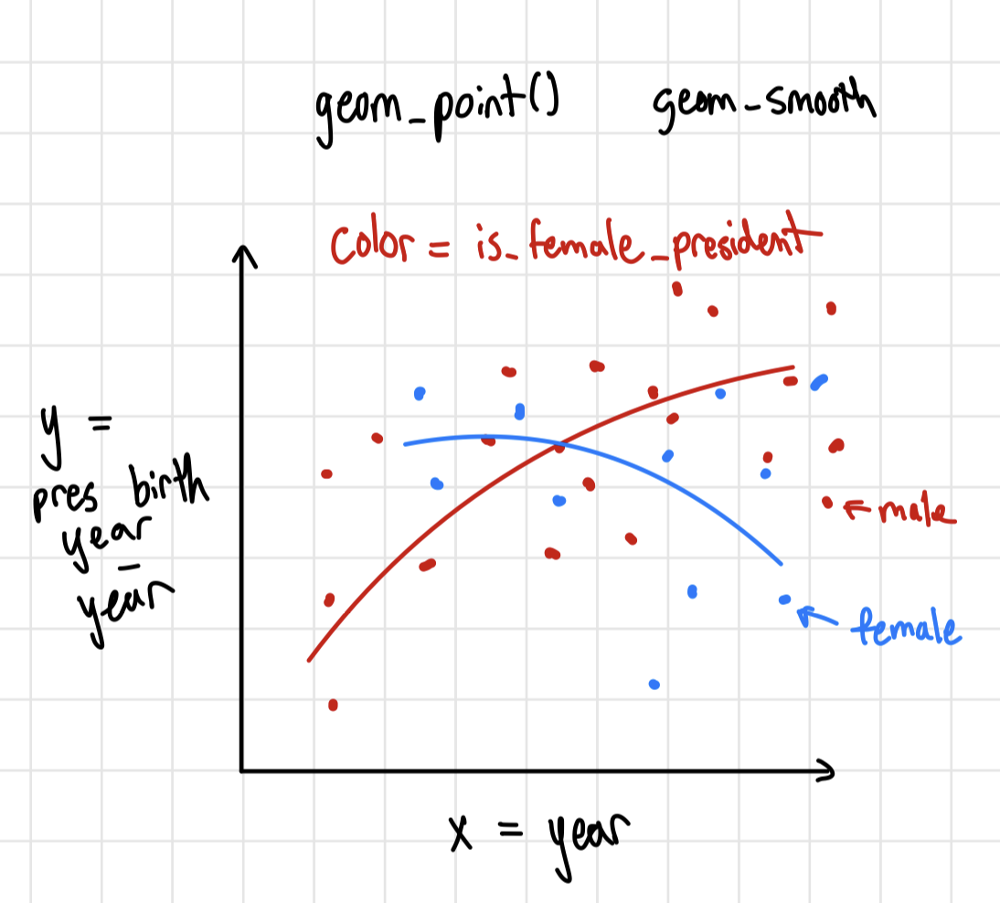
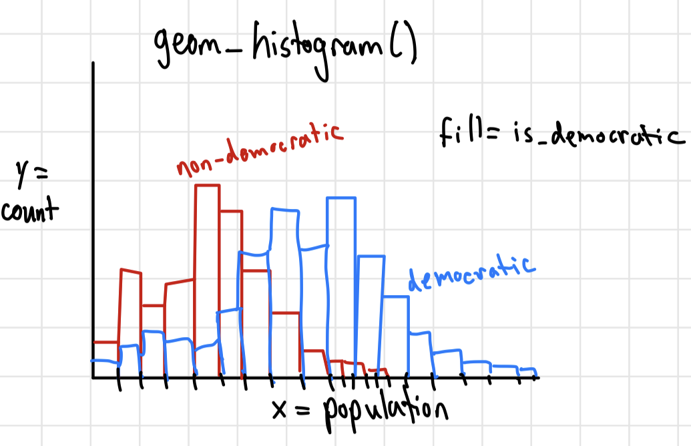

# Checkpoint 1

```{r}
#| output: false
library(tidyverse)
library(gt)
democracy_data <- readr::read_csv('https://raw.githubusercontent.com/rfordatascience/tidytuesday/main/data/2024/2024-11-05/democracy_data.csv')
```

## Data Context

The dataset is read in from Tidy Tuesday on GitHub and was curated by Jon Harmon. This dataset is an updated version of the [pacl](https://xmarquez.github.io/democracyData/reference/pacl.html#source) dataset, described in J. A. Cheibub, J. Gandhi, and J. R. Vreeland. "Democracy and Dictatorship Revisited". In: Public Choice 143.1-2 (2009), pp. 67-101. DOI: 10.1007/s11127-009-9491-2.

The data describes the regime types of countries around the world between the years 1950 and 2020. Each observation (row) is a country and year and contains information about that country's government regime in said year. Many of the variables recorded are booleans that indicate the political system or political rights of the country such as `is_communist` or `is_presidential`.

These data is important to measure and evaluate the differences across regimes, and evaluate changes in democracies on a global scale.

## Data Cleaning

The cleaning script for the data is in the code chunk below. The orginal pacl data is being cleaned and updated in this script.

```{r}
#| eval: false
#| code-fold: true
# Data from the package {democracyData}
# install.packages("pak")
# pak::pak("xmarquez/democracyData")
library(democracyData)
library(tidyverse)

democracy_data <-
  democracyData::pacl_update |> 
  janitor::clean_names() |> 
  dplyr::select(
    "country_name" = "pacl_update_country",
    "country_code" = "pacl_update_country_isocode",
    "year",
    "regime_category_index" = "dd_regime",
    "regime_category" = "dd_category",
    "is_monarchy" = "monarchy",
    "is_commonwealth" = "commonwealth",
    "monarch_name",
    "monarch_accession_year" = "monarch_accession",
    "monarch_birthyear",
    "is_female_monarch" = "female_monarch",
    "is_democracy" = "democracy",
    "is_presidential" = "presidential",
    "president_name",
    "president_accesion_year" = "president_accesion",
    "president_birthyear",
    "is_interim_phase" = "interim_phase",
    "is_female_president" = "female_president",
    "is_colony" = "colony",
    "colony_of",
    "colony_administrated_by",
    "is_communist" = "communist",
    "has_regime_change_lag" = "regime_change_lag",
    "spatial_democracy",
    "parliament_chambers" = "no_of_chambers_in_parliament",
    "has_proportional_voting" = "proportional_voting",
    "election_system",
    "lower_house_members" = "no_of_members_in_lower_house",
    "upper_house_members" = "no_of_members_in_upper_house",
    "third_house_members" = "no_of_members_in_third_house",
    "has_new_constitution" = "new_constitution",
    "has_full_suffrage" = "fullsuffrage",
    "suffrage_restriction",
    "electoral_category_index" = "electoral",
    "spatial_electoral",
    "has_alternation" = "alternation",
    "is_multiparty" = "multiparty",
    "has_free_and_fair_election" = "free_and_fair_election",
    "parliamentary_election_year",
    "election_month" = "election_month_year",
    "has_postponed_election" = "postponed_election"
  ) |>
  dplyr::mutate(
    election_month = dplyr::na_if(.data$election_month, "?")
  ) |> 
  tidyr::separate_wider_regex(
    "election_month",
    patterns = c(
      election_month = "\\D+",
      election_year = "\\d{4}$"
    ),
    too_few = "align_start"
  ) |> 
  dplyr::mutate(
    electoral_category = dplyr::case_match(
      .data$electoral_category_index,
      0 ~ "no elections",
      1 ~ "single-party elections",
      2 ~ "non-democratic multi-party elections",
      3 ~ "democratic elections"
    ),
    .after = "electoral_category_index"
  ) |> 
  dplyr::mutate(
    election_month = stringr::str_squish(.data$election_month),
    dplyr::across(
      c(
        tidyselect::ends_with("_index"),
        tidyselect::contains("year"),
        tidyselect::ends_with("_members"),
        "parliament_chambers"
      ),
      as.integer
    ),
    dplyr::across(
      c(
        tidyselect::starts_with("is_"),
        tidyselect::starts_with("has_")
      ),
      as.logical
    )
  )
```

The first section of the data cleaning process selects 41 columns from the pacl dataset, after using janitor package to clean the names of the variables. In this select statement, the majority of the columns are renamed to a more informative column name. Most of the logical data types (True or False) get the added `is_` or `has_` prefix and the other renamed columns add useful variable information such as `monarch_accession_year` instead of `monarch_accession`.

The next section of cleaning mutates the variables. The "?" value in `election_month` is replaced with NA's. `election_month` is split into two columns, on for the month and one for the year of the election (originally in the same variable). `election_month` also has the whitespace removed. A new character variable, `electoral_category` is created using the definitions from the `electoral_category_index`.

Lastly, any of the of the index, year, or members variables along with `parliament_chambers` are converted to integer datatypes. Then, all the `is_` or `has_` variables are converted to logical datatypes.

## Research Questions from Data

1.  How has president age changed over time and is there a difference for female presidents vs. male presidents?

2.  How long on average does it take countries that stopped being democratic to return to democracy?

## Research Questions with Supplemental Data

1.  How does happiness score differ by regime type? Is there a difference in happiness between different types of democratic regimes?

2.  Do more educated countries have more democratic regimes?

3.  How does the distribution of populations compare between democratic and non-democratic countries.

## Visualization Sketches

1.  For RQ 1 from these Data 

2.  For RQ 3 from supplemental data 

# Checkpoint 2

## Unmodified data summaries

### Count of Regimes and Percent of Dictatorships Per Country

*no new columns, requires custom function and iteration*

```{r}

count_regimes <- function(country) {

  regimes <- democracy_data |>
    filter(country_code == country) |>
    arrange(year) |>
    mutate(prev_regime = lag(regime_category)) |>
    filter(year == min(year) | regime_category != prev_regime)
    
  nrow(regimes)
  
}

count_dictatorships <- function(country) {

  dictatorships <- democracy_data |>
    filter(country_code == country) |>
    arrange(year) |>
    mutate(prev_regime = lag(regime_category)) |>
    filter(year == min(year) | regime_category != prev_regime, regime_category_index >= 3)
    
  nrow(dictatorships)
  
}

democracy_data |>
  distinct(country_code, country_name) |>
  mutate(n_regimes = map_dbl(country_code, count_regimes),
         n_dicts = map_dbl(country_code, count_dictatorships),
         prop_dict = n_dicts/n_regimes) |>
  select(country_name, n_regimes, prop_dict) |>
  arrange(desc(n_regimes)) |>
  gt() |>
  cols_label(country_name = "Country", 
             n_regimes = "Number of Regimes",
             prop_dict = "Percent Dictatorship") |>
  tab_style(cell_text(weight = "bold"),
            locations = cells_column_labels(everything())) |>
  fmt_percent(columns = prop_dict) |>
  data_color(prop_dict,
             palette = "Blues") |>
  tab_caption(caption = md("Counts of regimes per country, with the percent of regimes that were dictatorships."))


```

### Democratic Principals by Regime Categories

*no new columns, requires custom function and no iteration*

```{r}
summarize_regimes <- function(regimes = c("Civilian dictatorship",
                                          "Parliamentary democracy",
                                          "Military dictatorship",
                                          "Presidential democracy")) {
  democracy_data |>
    filter(regime_category %in% regimes) |>
    group_by(regime_category) |>
    summarize(
      n = n(),
      prop_demo = sum(is_democracy, na.rm = TRUE) / n,
      prop_suffrage = sum(has_full_suffrage, na.rm = TRUE) / n,
      prop_multiparty = sum(is_multiparty, na.rm = TRUE) / n,
      prop_free_fair = sum(has_free_and_fair_election, na.rm = TRUE) / n,
      prop_alternation = sum(has_alternation, na.rm = TRUE) / n
    ) |>
    gt() |>
    cols_label(
      regime_category = "Regime",
      n = "Number of Observations",
      prop_demo = "Democratic",
      prop_suffrage = "Full Voting Rights",
      prop_multiparty = "Multi-Party Elections",
      prop_free_fair = "Free & Fair Elections",
      prop_alternation = "Rotating Top Office"
    ) |>
    tab_style(
      cell_text(weight = "bold"),
      locations = cells_column_labels(everything())
    ) |>
    fmt_percent(columns = -c(n, regime_category)) |>
    tab_caption(
      caption = md("Percent of observations demonstrating democratic principals, by regime category")
    ) |>
    tab_spanner(
      label = "Democratic Principals Represented (% Observations)",
      columns = -c(n, regime_category)
    ) |>
    data_color(
      columns = -c(n, regime_category),
      palette = "Blues"
    )
}

summarize_regimes()
```

## Modified data summaries

### Percent of Independent Countries Over the Years

*new columns, requires custom function and iteration*

```{r}

is_not_ind <- function(regime_category_index, regime_category) {
  
  is.na(regime_category_index) | 
    regime_category %in% c("Colony", 
                           "British Overseas Territory")
  
}

democracy_data |>
  mutate(not_independent = map2_lgl(regime_category_index,
                                    regime_category,
                                    is_not_ind)) |>
  group_by(year) |>
  summarise(
    ind_count = sum(!not_independent),
    not_ind_count = sum(not_independent)
    ) |>
  mutate(prop_ind = ind_count/(ind_count + not_ind_count)) |>
  select(year, prop_ind, ind_count, not_ind_count) |>
  gt() |>
  cols_label(year = "Year", 
             prop_ind = "Proportion of Independent Countries", 
             ind_count = "Number of Independent Countries",
             not_ind_count = "Number of Non-Independent Countries") |>
  tab_style(cell_text(weight = "bold"),
            locations = cells_column_labels(everything())) |>
  data_color(prop_ind,
             palette = "Blues") |>
  fmt_percent(columns = prop_ind) |>
  tab_caption(caption = md("Yearly percent of recorded countries that were independent."))

```

### Forms of Governance by World Region

*new column for region, no iteration or custom function*

```{r}
library(countrycode)
democracy_data <- democracy_data |>
  # Creates the region column using the countrycode package
  mutate(region = countrycode(country_code,
                              origin = 'iso3c',
                              destination = 'region',
                              # Custom matches for the codes that don't find match
                              custom_match = c('ZAR' = 'Sub-Saharan Africa',
                                               'GER' = 'Europe & Central Asia',
                                               'NUR' = 'East Asia & Pacific',
                                               'PRI' = 'Latin America & Caribbean',
                                               'ROM' = 'Europe & Central Asia'
                                               )
                              )
         )

democracy_data |>
  group_by(region) |>
  # Proportions of each form of governance
  summarize(n = n(),
            prop_demo = sum(is_democracy, na.rm = TRUE)/n,
            prop_pres = sum(is_presidential, na.rm = TRUE)/n,
            prop_mon = sum(is_monarchy, na.rm = TRUE)/n,
            prop_comw = sum(is_commonwealth, na.rm = TRUE)/n,
            prop_colon = sum(is_colony, na.rm = TRUE)/n,
            prop_comm = sum(is_communist, na.rm = TRUE)/n
            ) |>
  gt() |>
  cols_label(region = "World Region", 
             n = "Number of Observations",
             prop_demo = "Percent Democratic",
             prop_pres = "Percent Presidential",
             prop_mon = "Percent Monarchy",
             prop_comw = "Percent Commonwealth",
             prop_colon = "Percent Colony",
             prop_comm = "Percent Communist",
             ) |>
  tab_style(cell_text(weight = "bold"),
            locations = cells_column_labels(everything())) |>
  fmt_percent(columns = -c(n, region)) |>
  tab_caption(caption = md("Percent of observations under each form of governance, by World Region.")) |>
  tab_spanner(label = "Governance Type (%)",
              columns = -c(n, region)) |>
  data_color(columns = -c(n, region),
             palette = "Blues")
```
